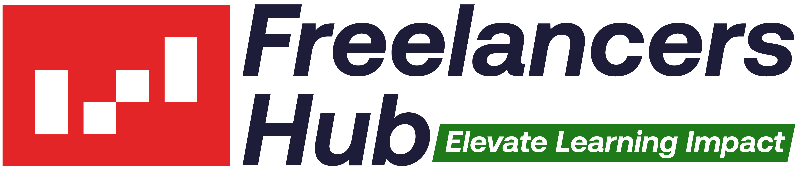

# IBDL Freelancers Hub — Frontend Web Application



> **Empowering Training Professionals, Facilitators & L&D Consultants across the GCC & Middle East.**

---

## 🚀 Overview

**IBDL Freelancers Hub** (`/client`) is a modern, high-fidelity web application built with **Next.js 16**, **TypeScript**, and **Tailwind CSS**. It serves as the digital front door and operational ecosystem for independent trainers, business consultants, and learning architects.

The platform provides seamless access to:

- **12 Core Hub Services**: End-to-end support covering Training Needs Analysis (TNA), program mapping, commercial solution proposals, content design, and ROI measurement.
- **Specialized IBDL Tools**: Exclusive access to Business Simulation Games, Assessment Tools (including PQP™), and IBDL Training Accreditation pathways.
- **Tiered Membership Ecosystem**: Flexible engagement levels (**Essential**, **Professional**, **Master**) tailored to every stage of a trainer's practice.
- **Bi-Directional Localization**: Complete support for both **English (LTR)** and **Arabic (RTL)** with native typography, layout mirroring, and Arabic-Indic numerals.

---

## 🎨 Key Features & Architectural Highlights

### 1. High-Fidelity UI & Design System

- **Deep Glassmorphism Theme**: Crafted with dark navy backgrounds (`#141428`), custom ambient lighting glows, glowing borders (`#5cb374`), and subtle micro-animations.
- **Compound Component Architecture**: Built strictly using compound component patterns (`Section.Header`, `Section.Grid`, `Section.Card`, `Section.Footer`) to ensure modularity, state decoupling, and 0 boolean-prop layout pollution.
- **Scroll-Triggered Entrance Animations**: Performant `IntersectionObserver` integrations for staggered reveal animations and dynamic counting-up numeric indices.

### 2. Localization & Accessibility (WCAG 2.1 AA)

- **Native LTR & RTL Support**: Driven by a custom `DirectionProvider` context that automatically switches layout direction, logical margins/paddings, and icon flips (`ArrowRight` / `ArrowLeft`).
- **Numeral Formatting**: Arabic-Indic numerals for Arabic locale and standard Latin numerals for English locale, maintaining strict brand consistency.

### 3. Integrated 3-Step Registration Engine

- **Modal & Floating CTA**: Accessible interactive 3-step registration flow accessible from any section or floating CTA button.

---

## 🛠️ Technology Stack

| Category              | Technology                                                          |
| :-------------------- | :------------------------------------------------------------------ |
| **Framework**         | [Next.js 16 (App Router & Turbopack)](https://nextjs.org/)          |
| **Language**          | [TypeScript 5+ (Strict Mode)](https://www.typescriptlang.org/)      |
| **Styling**           | [Tailwind CSS](https://tailwindcss.com/) & Custom CSS Design Tokens |
| **Iconography**       | [Lucide React](https://lucide.dev/)                                 |
| **Tooling & Linting** | ESLint, Prettier, Husky                                             |

---

## 📁 Repository Structure

```text
client/
├── .agent/rules/                # Architectural & code quality rules
├── public/                      # Static assets (Logos, favicons, graphics)
│   ├── Logos/                   # Official FLH & IBDL brand marks
│   └── img/                     # Favicons & ambient backdrop graphics
├── src/
│   ├── app/                     # Next.js App Router (Public routes & sub-catalogs)
│   │   ├── (public)/            # Landing page, games, assessments, accreditation
│   │   ├── globals.css          # Core design tokens, CSS reset & theme classes
│   │   └── layout.tsx           # Global Root Layout & Direction Provider
│   ├── components/
│   │   ├── common/              # DirectionProvider & LanguageToggle
│   │   ├── public/              # Public Landing Sections & Sub-components
│   │   │   ├── registration/    # RegistrationModal & RegistrationProvider
│   │   │   └── sections/        # Hero, Services, ValueChain, OfferPillars, Plans
│   │   └── ui/                  # Reusable Design System UI primitives (Button, StatusPill, Toast)
│   ├── config/                  # Presentation & Navigation routes configuration
│   ├── hooks/                   # Custom React hooks
│   ├── lib/                     # Utility functions (`cn`, class merger)
│   └── types/                   # TypeScript interfaces & discriminated union types
├── AGENTS.md                    # Authority rulebook for code quality & verification
├── tailwind.config.ts           # Extended Tailwind theme configuration
├── tsconfig.json                # Strict TypeScript configuration
└── package.json                 # Project dependencies & scripts
```

---

## ⚡ Getting Started

### Prerequisites

- **Node.js**: `v18.17.0` or higher
- **npm**: `v9.0.0` or higher

### Installation

1. **Clone the repository:**

   ```bash
   git clone https://github.com/IBDL-Freelance-Hub/web.git
   cd web
   ```

2. **Install dependencies:**

   ```bash
   npm install
   ```

3. **Run the local development server:**
   ```bash
   npm run dev
   ```
   Open [http://localhost:3000](http://localhost:3000) in your browser to view the application.

---

## 🛡️ Mandatory Verification Pipeline

Before committing or submitting a pull request, ensure all verification checks pass:

```bash
# 1. Type Check (0 TypeScript errors)
npx tsc --noEmit

# 2. Lint Check (0 ESLint errors)
npm run lint

# 3. Code Formatting Check
npx prettier --check .

# 4. Production Build Validation
npm run build
```

---

## 📄 License

Copyright © 2026 **IBDL Learning Group & Freelancers Hub**. All rights reserved.
